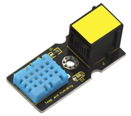
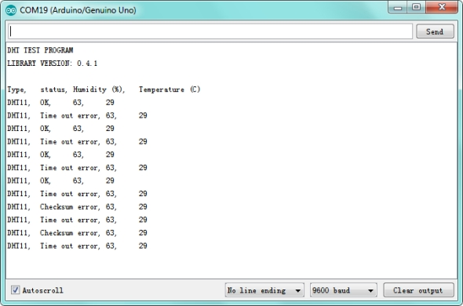

# KS0129 keyestudio EASY plug DHT11 Temperature and Humidity Sensor



## 1. Introduction

The DHT11 is a basic, ultra low-cost digital temperature and humidity sensor.

It uses a capacitive humidity sensor and a thermistor to measure the surrounding air, and provides a pre-calibrated digital signal output.

This DHT11 sensor has fast response, anti-interference ability, excellent reliability and long term stability.

**Special Note:**

The sensor/module is equipped with the RJ11 6P6C interface, compatible with our keyestudio EASY plug Control Board with RJ11 6P6C interface.

If you have the control board of other brands, it is also equipped with the RJ11 6P6C interface but has different internal line sequence, can’t be used compatibly with our sensor/module.

## 2. Specification

- Connector: Easy plug
- Supply Voltage: 5V
- Relative Humidity and temperature measurement
- Good for 20-90% humidity readings with 5% accuracy
- Good for 0-50°C temperature readings ±2°C accuracy
- Interface: Digital
- Low Cost

## 3. Technical Details

- Dimensions: 42mm * 20mm * 18mm
- Weight: 5.6g

## 4. Connect It Up

Connect the EASY Plug DHT11 sensor to control board using an RJ11 cable. Then connect the control board to your PC with a USB cable.


## 5. Upload the Code

Download Resource:  [Resource](./Resource.7z)

Note： before uploading the code, you need to import the library files; otherwise, the code upload will fail.

```c
#include <dht11.h>
dht11 DHT;
#define DHT11_PIN 9 

void setup()
{
    Serial.begin(9600);
    Serial.println("DHT TEST PROGRAM ");
    Serial.print("LIBRARY VERSION: ");
    Serial.println(DHT11LIB_VERSION);
    Serial.println();
    Serial.println("Type,\tstatus,\tHumidity (%),\tTemperature (C)");
}

void loop()
{
    int chk;
    Serial.print("DHT11, \t");
    chk = DHT.read(DHT11_PIN);//READ DATA
    switch (chk)
    {
        case DHTLIB_OK:
        Serial.print("OK,\t");
        break;
        case DHTLIB_ERROR_CHECKSUM:
        Serial.print("Checksum error,\t");
        break;
        case DHTLIB_ERROR_TIMEOUT:
        Serial.print("Time out error,\t");
        break;
        default:
        Serial.print("Unknown error,\t");
        break;
    }
    // DISPLAT DATA
    Serial.print(DHT.humidity,1);
    Serial.print(",\t");
    Serial.println(DHT.temperature,1);
    delay(1000);
}
```

## 6. Result

Open the Serial monitor to see the temperature and humidity data.


